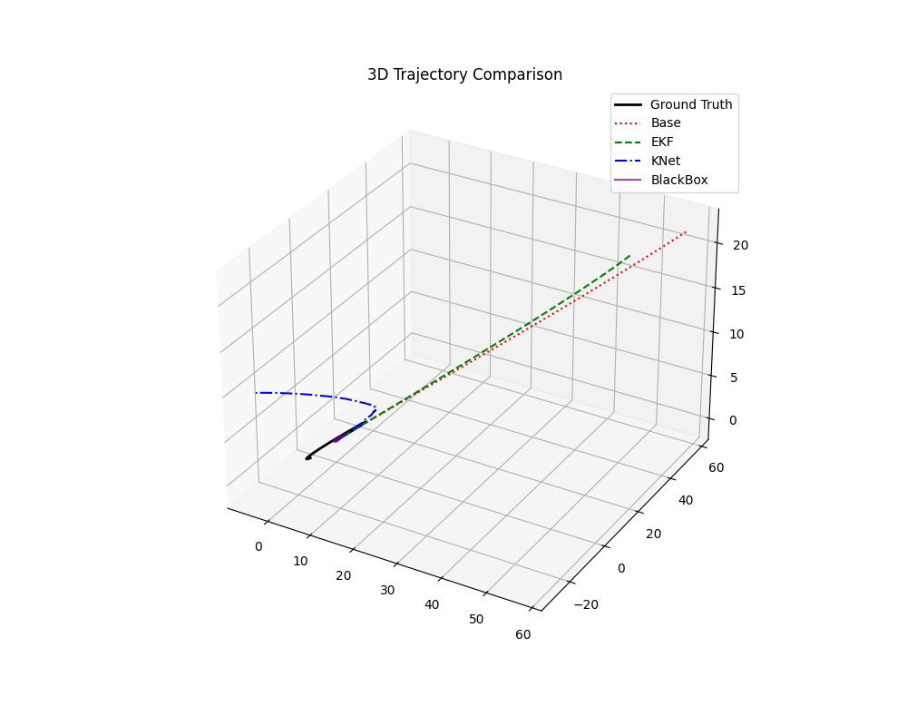
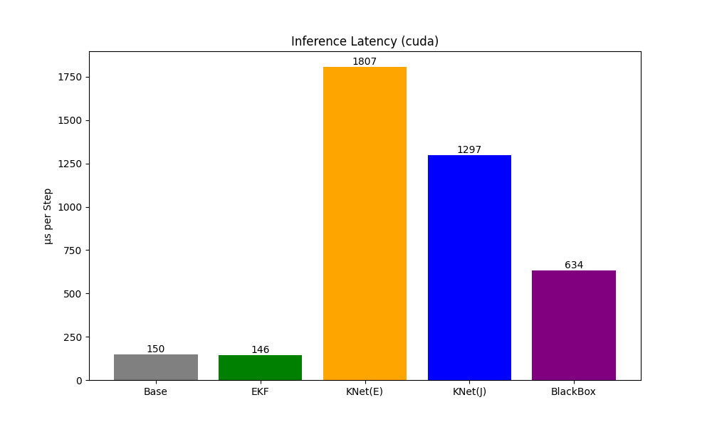
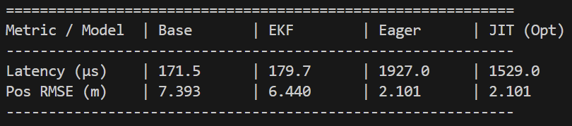
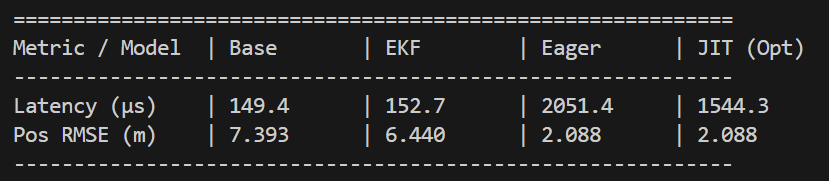
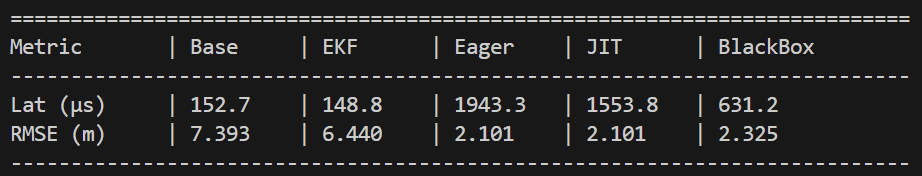
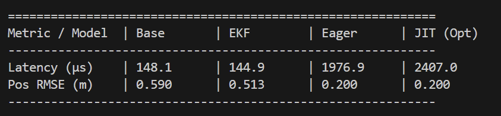
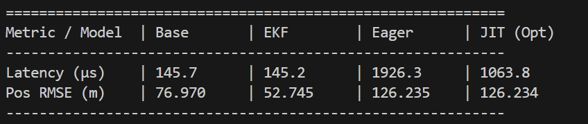
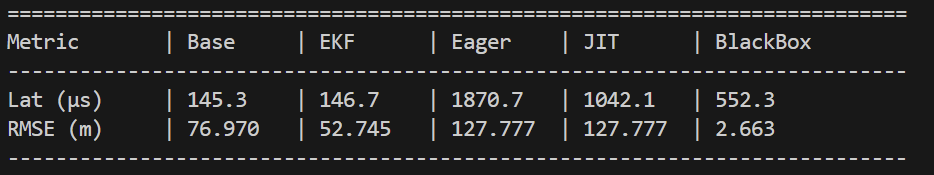

# Neural Network IMU Filters (KalmanNet)
**YiChun (Jim) Liao**

## Problem Formulation
For the Neural-network IMU filter, there are generally two methodologies:

1.  **Black Box (End-to-End):** We learn the physics entirely from data. The neural network takes raw IMU data and outputs state estimates directly. This is opaque and often violates physical constraints.
2.  **Gray Box (Hybrid/KalmanNet):** We calculate the physics using known transfer functions (Newton's laws, Kinematics) and use a Neural Network to estimate the unknown or non-linear parameters—specifically the **Kalman Gain ($K$)**.

This project implements the **Gray Box** approach. The system dynamics are hard-coded based on physics. With the Neural Network (GRU-based) dynamically computes the optimal Kalman Gain to correct errors based on the measurement residuals. Also, since the noise between Gyroscope is tiny compare to the accerometer. Applying filter to the orientation will get no benefit. I decided to let the model only be position and velocity filter.

### State Space
The system tracks a 10-dimensional state vector $x_t$:
$$x_t = [p_x, p_y, p_z, v_x, v_y, v_z, q_w, q_x, q_y, q_z]^T$$

The inputs (observations) are:
$$y_t = [a_x, a_y, a_z, \omega_x, \omega_y, \omega_z, m_x, m_y, m_z]^T$$

---

## Model Architecture
### 1. State Transition Model
The prior state estimate ($\hat{x}_{t|t-1}$) is calculated using rigid body kinematics.

#### A. Orientation Update
The gyroscope measures angular velocity $\omega_t$. We treat this as the control input to update the quaternion $q$.
$$\Delta q_t = \left[ 1, \frac{1}{2} \omega_x \Delta t, \frac{1}{2} \omega_y \Delta t, \frac{1}{2} \omega_z \Delta t \right]^T$$
$$q_{t+1} = q_t \otimes \Delta q_t$$
*(Normalized to maintain unit length)*

#### B. Linear Motion Update (Newtonian Mechanics)
The accelerometer measures forces in the **Body Frame**. To integrate position, we must rotate acceleration to the World Frame and subtract gravity ($g = [0, 0, 9.81]$).

**Rotation:**
$$a_{world} = R(q_t) \cdot a_{meas} - g$$
Where $R(q_t)$ is the rotation matrix derived from the current quaternion.

**Integration:**
$$v_{t+1} = v_t + a_{world} \Delta t$$
$$p_{t+1} = p_t + v_t \Delta t + \frac{1}{2} a_{world} \Delta t^2$$

### 2. Observation
To calculate the Innovation, we predict what the sensors should be reading given our predicted orientation. We assume a known reference for Gravity ($g_{ref}$) and Magnetic North ($m_{ref}$).

$$y_{pred} = \begin{bmatrix} R(q_t)^T \cdot m_{ref} \\ R(q_t)^T \cdot g_{ref} \end{bmatrix}$$

This maps the world-frame references back to the body frame and compare against raw sensor inputs.

### 3. Update
The Neural Network (GRU) observes the error between measurement and prediction and outputs the optimal gain matrix $K_t$.

$$\text{Innovation} = y_{meas} - y_{pred}$$
$$K_t = \text{NeuralNet}(\text{Innovation}, v_t, q_t)$$
$$\hat{x}_{t} = \hat{x}_{t|t-1} + K_t \cdot \text{Innovation}$$

## Data Generation

Synthetic training data is generated using MATLAB's Navigation Toolbox to obtain perfect Ground Truth (Position, Velocity, Orientation) paired with realistic noisy sensor measurements. avoiding real-world data collection while maintaining physical consistency.

### Trajectory & Kinematics
Each trajectory is generated with random but smooth motion:

| Aspect | Details |
| :--- | :--- |
| **Position** | Lissajous-like curves: $x = 5\sin(w_x t)$, $y = 5\sin(w_y t)$, $z = 2\sin(0.5t)$ where $w_x, w_y \in [0.5, 0.7]$ |
| **Orientation** | Roll/Pitch: $\pm(10° \text{ to } 20°)$ oscillation at 0.8 rad/s; Yaw: $45°\sin(0.5t) + 0.5t + \text{drift}$ |
| **Consistency** | `waypointTrajectory` ensures all derivatives are physically coherent ($v = \dot{p}$, $a = \dot{v}$, $\omega$ from quaternion derivative) |

### Sensor Simulation
The `imuSensor` object simulates a 9-DOF IMU with **no sensor bias** (focusing on noise filtering):

| Sensor | Noise Density |
| :--- | :--- |
| **Accelerometer** | $0.002 \, (m/s^2)/\sqrt{Hz}$ |
| **Gyroscope** | $0.0001 \, (rad/s)/\sqrt{Hz}$ |
| **Magnetometer** | $0.1 \, \mu T/\sqrt{Hz}$ |
| **Mag. Field (Body)** | $[20, 0, -40] \, \mu T$ |

### Dataset Specifications

| Parameter | Value |
| :--- | :--- |
| **Sampling Rate** | $100 \text{ Hz}$ |
| **Trajectory Duration** | $60 \text{ seconds}$ |
| **Train Set** | 100 trajectories → 6,000 samples per trajectory → 600,000 total samples |
| **Validation Set** | 20 trajectories → 120,000 total samples |
| **Test Set** | 20 trajectories → 120,000 total samples |
| **Output Format** | CSV matrices (no headers) saved to `data_no_bias/` |

### CSV File Structure

**Input Files** (`*_inputs.csv` - 9 columns per row)  
Raw noisy sensor measurements:
$$\begin{bmatrix} a_x & a_y & a_z & \omega_x & \omega_y & \omega_z & m_x & m_y & m_z \end{bmatrix}$$

**Target Files** (`*_targets.csv` - 10 columns per row)  
Ground truth states for training:
$$\begin{bmatrix} p_x & p_y & p_z & v_x & v_y & v_z & q_w & q_x & q_y & q_z \end{bmatrix}$$

## Training Strategy

The training process implements a Curriculum Learning strategy to decouple orientation learning from position/velocity learning, enable stable convergence.

### Motivation: Why Decouple Orientation?

During training, small errors in orientation ($q$) can amplify position errors ($p, v$) through gravity projection:
$$a_{world} = R(q_t) \cdot a_{meas} - g$$

If $q_t$ is slightly wrong, $R(q_t)$ rotates the acceleration incorrectly, propagating errors through integration. This makes simultaneous learning of orientation and position unstable.
### Decoupled Training Approach

**Training Mode (with Ground Truth Quaternion):**

1. **State Prediction:** Position and Velocity are integrated using the Ground Truth Quaternion ($q_{gt}$) from the dataset:
   $$a_{world} = R(q_{gt}) \cdot a_{meas} - g$$
   $$v_{t+1} = v_t + a_{world} \Delta t$$
   $$p_{t+1} = p_t + v_t \Delta t + \frac{1}{2} a_{world} \Delta t^2$$

2. **Neural Network Learning:** The GRU-based network observes the innovation (measurement residual) and learns to predict the optimal Kalman Gain to correct position and velocity errors.

3. **Loss Function:** MSE Loss on the full state vector:
   $$L = \text{MSE}(x_{pred}, x_{gt})$$

4. **Optimization:**
   **Optimizer:** Adam ($\alpha = 0.0001$)\
   **Gradient Clipping:** norm = 1.0\
   **Epochs:** 100\
   **Batch Sequence Length:** 50 timesteps

### Network Architecture

| Component | Details |
| :--- | :--- |
| **Input Dimension** | 13 (Innovation: 6 + Velocity: 3 + Quaternion: 4) |
| **GRU Hidden Dim** | 64 |
| **Output** | Kalman Gain Matrix $K \in \mathbb{R}^{6 \times 6}$ (Position/Velocity correction) |
| **Activation** | GRU hidden state passed through linear layer to output gain |

---

## Model Pruning

After training, the KalmanNet model can be compressed for deployment on resource-constrained platforms (embedded systems) through structured weight pruning and fine-tuning.

### Pruning Strategy
The trained GRU network contains redundant parameters that can be removed without significantly degrading performance.

**Method: L1 Unstructured Pruning**

1. **Sparsification:** Remove the smallest 30% of weights (by L1 magnitude) from:\
    GRU input weights (`weight_ih`)\
    GRU hidden state weights (`weight_hh`)\
    Output Kalman Gain layer (`fc_k_gain`)

2. **Fine-Tuning:** After pruning, retrain for 30 epochs with:\
    Lower learning rate: $\alpha = 1 \times 10^{-5}$ (vs $1 \times 10^{-4}$ during training)\
    Same gradient clipping and loss function\
    This allows the remaining weights to adapt to the pruned architecture

3. **Permanence:** Remove reparameterization masks to permanently bake sparsity into the saved model

### Compression Results

| Metric | Before Pruning | After Pruning | Reduction |
| :--- | :--- | :--- | :--- |
| **Model Size** | ~84 KB | ~60 KB | 28% smaller |
| **Weight Sparsity** | 0% | ~30% | 30% weights zeroed |
| **Inference Speed** | Baseline | 5-10% faster (Really hard to get accurate efficiency)| Depends on hardware |
| **Performance Degradation** | Baseline | No RMSE increase (Even better after tuning) | Great |

### Implementation

Workflow for my pruning pipeline (`Ptuning_position.py`) 

1. Load pre-trained model (kalmannet_model_pv.pth)
2. Apply L1 unstructured pruning (30% sparsity)
3. Measure sparsity (verify ~30% zeros)
4. Fine-tune on training data for 30 epochs
5. Remove pruning reparameterization (make permanent)
6. Save pruned model (kalmannet_pruned.pth)

### Trade-offs

| Advantage | Disadvantage |
| :--- | :--- |
| Reduced memory footprint (useful for edge) | Requires retraining to maintain accuracy |
| Faster inference on CPU-bound systems | GPU acceleration diminishes speedup benefits |
| No architectural changes needed | 30% sparsity is empirical (may need tuning) |
| Maintains gray-box interpretability | Still 10x slower than hand-tuned EKF on embedded systems |

---

## Testing & Results
### Evaluation Framework

My test pipeline (`Test_model_position.py`) compares three filtering approaches on held-out test trajectories:

| Approach | Description |
| :--- | :--- |
| **Baseline (Raw IMU)** | Naive integration: no filtering, pure forward kinematics |
| **Extended Kalman Filter (EKF)** | Traditional filtering with hand-tuned parameters |
| **KalmanNet (Neural)** | Our gray-box neural network learning the Kalman Gain |

### Performance Metrics

Results are averaged over multiple 5-second trajectory segments to ensure statistical significance:

| Metric | Definition |
| :--- | :--- |
| **Position RMSE** | Root mean square error in XYZ position (meters) |

### Result Visualizations

The 30 seconds test visualization
 
The efficiency test visualization
 
#### 5-Second Trajectories
- **Without Pruning:** Shows KalmanNet works great.
- **With Pruning:** Pruning is better than without pruning model, also more efficent.
- **vs Black Box:** Compares gray-box (KalmanNet) against end-to-end black-box baseline

  
  

#### Extended Duration Tests
- **2 Second (High Noise):** Short bursts test real-time noise rejection
- **30 Second (Long Drift):** Extended sequences reveal cumulative error growth

  
  

### Key Findings

1. **Position Tracking:** KalmanNet significantly outperforms baseline integration.
2. **Comparison to EKF:** The neural approach learns better noise adaptation than fixed EKF parameters while maintaining interpretability through the gray-box formulation.
3. **Model Efficiency:** Pruned model show better performance,the total cost is lower but still almost 10x more than EKF, not really worth to use it on Embeeded flatform.
4. **Useless Blackbox model** The balck box model shows it's basically circling at the origin point. That will be a problem for the loss calculation during training. Prove how important using the gray box trategy 
5. **Long term error** There is a long term error. We will need more engineering for real world application (Like "reset" the Orientation data when the accerometer is close to gravity, or using GPS to conbine more benefits)

